# rm-Galivan_MiSTer

FPGA core for the Nichibutsu **Galivan** arcade hardware (PCB `GV-1412-I` +
`GV-1412-II`) targeting the
[MiSTer FPGA](https://github.com/MiSTer-devel) platform (Terasic DE10-Nano).

**One RBF, three games, all fourteen sets of MAME's `galivan.cpp`**:
*Cosmo Police Galivan* (1985), *Ufo Robo Dangar* (1986) and *Ninja Emaki* /
*Youma Ninpou Chou* (1986). That includes the **three sets MAME itself marks
`MACHINE_NOT_WORKING`** — the two Game Electronics bootlegs of *Youma Ninpou
Chou* and the Tecfri licence of *Ninja Emaki* — and both custom chips of the
family, the **NB1412M2** protection and the **NB1414M4** text blitter.

This core reimplements the hardware in SystemVerilog from the MAME driver, read
line by line — every non-obvious fact in the RTL carries its
`galivan.cpp:<line>` citation in a comment — and, for the sets that MAME does
not run yet, from the program ROMs themselves, disassembled.

---

# The `rm` version

*This section is the same in every `rm` core: it explains what the line is and
what it adds. Skip it if you already know.*

**`rm` cores are my own builds, published outside the MiSTer-devel tree.** On
top of the emulation they carry two things the official tree cannot host,
because both require editing the `sys/` framework and MiSTer-devel does not
take those changes.

### 1. CRT geometry that leaves HDMI alone

**CRT Adjust** (H-Size, H-Position, V-Shift) and **CRT V-Size** let you align
and size the picture on a 15 kHz tube from the OSD, with the sync left native
so the screen never loses lock, and without duplicating or dropping a single
line.

The point of the whole thing is *where* they sit: **sys-side**, in the analog
chain between the scanline stage and the OSD. The scaler taps the video
**before** that point, so **HDMI stays bit-identical while you adjust the
CRT** — you can align a tube without touching what a capture card or a
streaming setup sees.

V-Size offers two modes: **PVM** (retimes the lines — perfect on broadcast
monitors with a wide lock range) and **Cabinet** (native timing, photometric —
the sync stays rock-steady on arcade chassis with tight AFC).

### 2. Pause overlay

Logo, supporters list and scrolling credits, shown while the game is paused.

### Naming

| | |
|---|---|
| repository / folder | `rm-<Title>_MiSTer` |
| Quartus project and RBF | `rm<Title>` |
| MRA files | `rm <Title> (…).mra` |

The `rm` RBF has a **different file name** from the official core, so the two
can sit on the same SD card without overwriting each other, and you choose
which one to launch from the MRA.

---

## About the games

**Ufo Robo Dangar** (*UFOロボ ダンガー*) is a vertically-scrolling shooter in
which you pilot a fighter that **transforms into a giant robot** — a direct nod
to the mecha anime of the era. The parent set is unprotected; the Japanese
release carries the **NB1412M2** on a DG-3 daughter card with its own 8 MHz
crystal and an 8 KB ROM, and the two bootlegs run because their protection
check is patched out in the ROM.

**Cosmo Police Galivan** (1985) is the earlier game on the same board — a
run-and-gun platformer where the player can hang from ceilings with a third
button.

**Ninja Emaki** (1986), known in Japan as *Youma Ninpou Chou*, is a ninja
action game on the same board. It differs in the glue rather than in the
hardware: the I/O sits at different addresses, the background map is 512×32
scanned by columns instead of 128×128 by rows, the sprite RAM is twice the size
and there are four ROM banks instead of two. What really sets it apart is the
**NB1414M4**, a blitter that writes the whole text layer by itself out of a
16 KB data ROM — and that also produces the background scroll, because this
board has no scroll registers in its I/O map.

Around it sit three variants that were not running yet: two **Game Electronics
bootlegs** that removed the blitter from the board, and a **Tecfri licence**,
made in Spain, that removed it too — in a different way.

## Status

**Current version: 1.0.**

All **fourteen sets** of `galivan.cpp`, one RBF. The MRA picks the set; a
board-select byte, downloaded before the ROMs, picks the hardware variant. The
core boots and plays on real MiSTer hardware with video, audio, inputs, DIP
switches and savestates.

---

# The three sets marked as not working

Three of the fourteen sets are marked `MACHINE_NOT_WORKING` in MAME. For the
bootlegs the driver notes that the player is invincible; for the Tecfri licence
there are no notes yet.

All three were worked out the same way: the program ROMs were disassembled and
compared byte by byte against the original Nichibutsu sets, which MAME already
runs well. The driver was the starting point for all of it, and the result is
written up in a form that can go back upstream.

## The Game Electronics bootlegs (`youmab`, `youmab2`)

**What the bootleggers did.** They took the Japanese *Youma Ninpou Chou*,
pulled the NB1414M4 off the board, and added a third program ROM of 32 KB,
banked into `0x8000-0xBFFF` by port `0x82`. Comparing against the original
accounts for every byte: **57 bytes** changed in the fixed ROM, **237** in the
banked one, and one new 16 KB bank — bank 0 of the extra ROM is byte-for-byte
the original's `ync-2`.

**The "protection" is dead code.** The extra ROM holds a self-test that looks
fearsome: it measures a square wave on port `0x8A` and demands between 240 and
271 loop iterations per half-period — about 226 Hz — and if it fails it prints
the faulty chip on screen, `IC 44` or `IC 46`, and halts. Port `0x00` drives a
computed jump.

None of it ever runs. The bootleggers patched the boot at `$1838` to jump to
`$4577`, where they **preset the pass flag** — `$FFF6 = 0x24` — before the test
is reached, so both the timing check and the port `0x00` read are skipped for
good. Whatever those ports return is irrelevant.

**What their code really does** is replace the blitter in software. The nine
places where the original sent a command to the NB1414M4 now load a parameter
and jump to a stub that banks the extra ROM in, and an `RST $30` dispatcher with
an inline pointer table sends each call into the bootleggers' own text routines.

**The two sets** differ in exactly one byte of text — the copyright year,
`1987` against `1986` — and in a four-byte lives table.

**The invincible player comes from a DIP switch.** At
`$18AA` the game builds `$E442 = ~((DSW2 & 0xF0) | (DSW1 >> 4))`, and the hit
handler at `$47C5` tests its bit 7: with *Allow Continue* on **5 Times** or
**99 Times** the damage is skipped, and *5 Times* is the default. Both routines
are byte-identical in the original `youma`, so this is Nichibutsu's own
behaviour — the MRAs here default to *3 Times*, and the player dies.

**The text layer.** On Ninja Emaki the first 18 cells of text VRAM are not
drawn and writes to `0xD800-0xD81F` are ignored, because on that board those
cells hold the blitter's parameters. The bootleg has no blitter: there they are
ordinary characters, and the bootleggers draw their interface in them — 21
references in their ROMs. The core applies the Ninja Emaki rule to Ninja Emaki
only, so the bootleg interface starts where it should.

## The Tecfri licence (`ninjemat`)

**It is Ninja Emaki recompiled for Galivan's I/O decoder.** The initialisation
routine is identical to `ninjemak`'s with only the port numbers changed —
`OUT ($80)` → `OUT ($40)`, `($85)` → `($45)`, `($86)` → `($46)` — the inputs
move to `0x00-0x04`, and the scroll comes from Galivan's hardware registers
instead of the blitter.

**The blitter is not on the board**, and it was removed with a scalpel: each of
the nine calls to the chip was disabled **by changing one byte**, the opcode
`21` (`LD HL,<command>`) into `C9` (`RET`). In their place sits a software text
engine at `$1900` with its own string table — `INSERT COIN`, `PUSH START
BUTTON`, `HI-SCORE` — strings that on `ninjemak` exist only inside the chip's
data ROM. It even writes the same attribute bytes the chip wrote, `$F7` for the
interface and `$FB` for the credit digits.

**The text VRAM answers at two addresses**, `$C800-$CFFF` and `$D800-$DFFF`,
because A12 is not decoded: the engine writes `CREDIT` at `$C869`, and another
routine puts the credit digits at `$D878` — the last cells of that same string.

**The background map is Ninja Emaki's, folded.** The 512×32 strip is cut into
four pieces of 128 columns and stacked into a 128×128 square, which is what
Galivan's tilemap can address — verified on **16384 cells out of 16384**. The
scroll confirms it: the vertical scroll carries two bits taken from the
horizontal one, which is the carry of the fold. It also explains why this
set's background does not display correctly yet: read with Ninja Emaki's
layout, a folded map comes out as columns.

**The ROM bank is four-way, with its two bits swapped** relative to Ninja Emaki
— read from the 28 callers of the one routine that writes the port, which match
`ninjemak`'s one to one.

**And 16 KB of the dump are missing.** Ninja Emaki keeps its terrain-collision
map in ROM banks 0 and 1 and its code in banks 2 and 3. The Tecfri ROM is 16 KB,
and it is banks 2 and 3. The collision map is in none of the sixteen ROMs of the
set — searched by its signature in every one of them. This is most likely why
the set was marked as not working: without that map the game reads its own code
as terrain, the character walks into walls that are not there, and dying on the
ground derails the state machine.

The MRA **borrows the map from `ninjemak`** — the same game, with levels proven
byte-identical by the fold, and a collision routine identical down to the index.
It is a substitution, and it is declared rather than hidden: see
[Sets provided](#sets-provided).

## The two custom chips

**NB1412M2** — the protection of the Japanese Dangar, on the DG-3 daughter
card. Of the whole chip only the decrypter is needed here (the timer and DAC
control belong to Mighty Guy): `rom[addr & 0x1fff] - ((0x43 - rom[adj]) & 0xff)`,
over two I/O ports that are *added* to Galivan's.

**NB1414M4** — the text blitter of Ninja Emaki. Written as a microcode table, one
line per line of MAME's own routine, plus four separate primitives, and
**verified differentially**: the same synthetic ROM and parameters go to a Python
port of `nb1414m4.cpp` and to the RTL in ModelSim, then the 2 KB of VRAM are
compared — **71 cases out of 71 identical byte for byte**. The bench found three
real bugs that reading could not: a ROM byte sampled one cycle early, a
pointer-table index masked in the wrong order, and the fact that MAME reads the
VRAM **live** rather than from a snapshot.

Neither chip is exclusive to this board: the same parts drive Mighty Guy, Terra
Cresta, Legion, Terra Force, Kozure Ookami, Crazy Climber 2 and Armed F.

## Notes that may help the MAME driver

Findings from the ROMs that could be useful upstream:

- **`youmab`, invincible player** — the behaviour comes from the default of a
  DIP switch, and the original `youma` has the same code.
- **`ninjemat`, protection flag** — the board has no NB1414M4: the calls to it
  are disabled in the program.
- **`ninjemat`, `8.e16`** — the ROM holds banks 2 and 3, so it would sit at
  `0x14000`; `0x10000-0x13FFF` corresponds to the part that has not been dumped.
- **`ninjemat`, configuration** — the board combines Galivan's I/O and
  background layout with Ninja Emaki's text, sprites and palette.
- **`youmab`, writes to `0xD800-0xD81F`** — they are the bootleggers' interface.
- **`youmab`, port `0x8A`** — it is not read during play, so any value works.

## Documented in depth

Four write-ups in [docs/](docs/), in Italian, each built from the ROMs and the
MAME source rather than from observed behaviour, with every address quoted:

- **[CHIP_NICHIBUTSU.md](docs/CHIP_NICHIBUTSU.md)** — NB1412M2 and NB1414M4:
  register maps, why each module is built the way it is, how the blitter was
  verified.
- **[YOUMAB_PROTEZIONE.md](docs/YOUMAB_PROTEZIONE.md)** — the Game Electronics
  bootlegs, disassembled.
- **[NINJEMAT.md](docs/NINJEMAT.md)** — the Tecfri licence, worked out from its
  own ROMs.
- **[MAME_YOUMAB_NOTE.md](docs/MAME_YOUMAB_NOTE.md)** — the
  bootleg findings written up as a possible contribution to MAME.

---

## What else is in the core

**Video.** 256×224 at **59.4106 Hz**, ROT270. The graphics decode is **verified
pixel by pixel against MAME**: Nichibutsu's layouts are `gfx_*_packed_lsb`, so
the *even* pixel lives in the **low** nibble — the opposite of the common MSB
packing, and exactly the kind of swap that produces a picture that looks nearly
right and is wrong. A script decodes every char, tile and sprite twice, once
through MAME's rules and once through the core's: **425,984 pixels, 0
differences**. The background is built as a full line buffer, so the latency of
the SDRAM never reaches the pixel path. Text, background and sprites can each be
toggled from the OSD, and the picture can be rotated (No / CCW / CW) and flipped.

**Audio.** YM3526 via jtopl at the board's real 4 MHz, plus two 8-bit R2R DACs,
mixed at the driver's own ratios. The board's three analog filters — the two
Sallen-Key stages on the DACs and the one on the YM output — are reproduced as
**biquads at the chip's actual sampling rate**, 4 MHz / 72 = 55555.6 Hz, not a
round number picked for convenience. **Limit cycles are killed**: a biquad with
truncating arithmetic can sit in a self-sustaining low-level oscillation, an
audible hiss on silence, so the rounding is **magnitude truncation**, the
textbook cure.

**Savestates.** **32 slots**, complete: both Z80s register-exact, work RAM, char
RAM, the sprite buffer and the live sprite RAM, the video and audio registers,
and a **shadow of all 256 YM3526 registers**. The chip has no readable register
file, so the shadow is **replayed into it** on restore, register by register,
with the CPU held off the bus — music resumes on the right instruments.

**Timing.** Every clock closes positive, setup and hold, with zero total
negative slack.

**CRT.** See the `rm` section at the top. **H-Size has 64 steps (−32..+31)**
instead of the usual 32: Dangar's raster is 384 clocks wide with only 256
active, nearly double the blanking of the 15 kHz standard, so at the native
ratio the image comes out narrow on most tubes. H-Size 0 is the native ratio,
and the picture is widened from the OSD rather than by a baked-in default —
**without changing a single frequency**: HSync stays at 15625.0 Hz and VSync at
59.4106 Hz. CRT Adjust is **independent of the HDMI Scale option**: integer
scaling only changes what the HDMI scaler does, and never switches the analog
controls off.

### A note on how the CRT controls work

The picture is not rescaled: every source pixel is emitted for an **integer**
number of pixel-clock periods through a line buffer, so H-Size is free of
shimmering and of scaling artifacts, and the content is byte-exact. The
horizontal sync is left **native** — the CRT keeps its lock while you resize
and slide the image, which is why nothing rolls or tears during adjustment.

V-Size does not duplicate or drop lines either: it retimes the line period and
the line count per frame so their product stays exactly one frame, spreading
the same unique lines further apart. In **Cabinet** mode it instead keeps the
native timing and redistributes light between adjacent lines in linear gamma,
so the sync never moves at all — made for arcade chassis with a tight AFC.

---

## Sets provided

Fourteen MRAs, from three merged zips. The three parents sit in
[releases/](releases/); the other eleven are in
`releases/_alternatives/_rm <Game>/`, which is the layout the MiSTer arcade
menu expects.

| MRA | MAME set | |
|---|---|---|
| `rm Ufo Robo Dangar (4-09-1987).mra` | `dangar` | parent |
| `rm Ufo Robo Dangar (12-1-1986).mra` | `dangara` | alternative |
| `rm Ufo Robo Dangar (9-26-1986, Japan).mra` | `dangarj` | alternative — NB1412M2 |
| `rm Ufo Robo Dangar (9-26-1986, bootleg set 1).mra` | `dangarb` | alternative |
| `rm Ufo Robo Dangar (9-26-1986, bootleg set 2).mra` | `dangarbt` | alternative |
| `rm Cosmo Police Galivan (12-26-1985).mra` | `galivan` | parent |
| `rm Cosmo Police Galivan (12-16-1985).mra` | `galivan2` | alternative |
| `rm Cosmo Police Galivan (12-11-1985).mra` | `galivan3` | alternative |
| `rm Ninja Emaki (US).mra` | `ninjemak` | parent — NB1414M4 |
| `rm Youma Ninpou Chou (Japan).mra` | `youma` | alternative |
| `rm Youma Ninpou Chou (Japan, alt).mra` | `youma2` | alternative |
| `rm Youma Ninpou Chou (Game Electronics bootleg, set 1).mra` | `youmab` | alternative — no blitter |
| `rm Youma Ninpou Chou (Game Electronics bootleg, set 2).mra` | `youmab2` | alternative — no blitter |
| `rm Ninja Emaki (Tecfri license).mra` | `ninjemat` | alternative — no blitter |

> **`ninjemat` uses one ROM that is not part of its set.** Its 16 KB
> terrain-collision map was never dumped, so the MRA takes the first 16 KB of
> `ninjemak.3` from the parent: the same game, with byte-identical levels and
> the same collision routine. Delete that one `<part>` line and you get the
> board exactly as it was dumped — the core does not change, it simply reads
> zeros where the map should be.

## Known issues

- **`ninjemat`** runs with the borrowed collision map described above.
- **`ninjemat`** also behaves differently from Ninja Emaki in places, the attract
  mode among them, and that is in its ROM rather than in the core: the Tecfri
  adaptation removed part of the DIP settings handling — twelve `NOP`s at
  `$17C7` and twelve more at `$1822`, where Ninja Emaki merges the two DIP words
  — and the block that loads those parameters into the game structure is gone.

## Screenshots

Each game in both orientations: **Yoko** is the board's native raster on a
horizontal screen, **Tate** is the picture rotated upright, as on a vertical
cabinet.

| | |
|---|---|
| 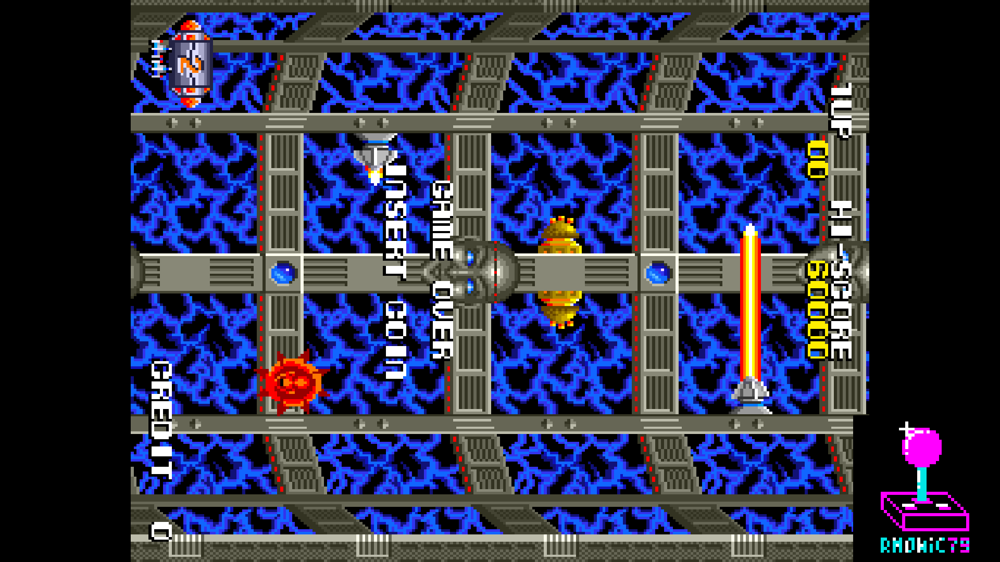 | 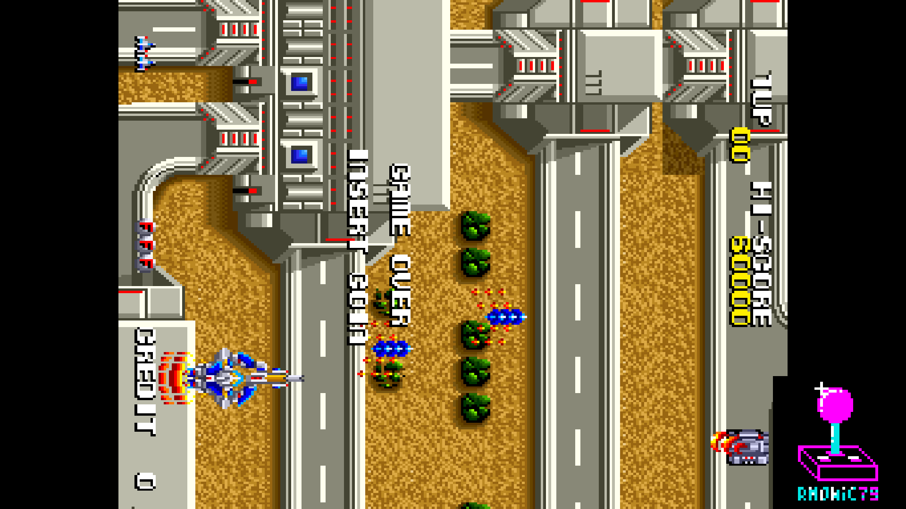 |
| Ufo Robo Dangar — attract, yoko | Ufo Robo Dangar — the base, yoko |
| 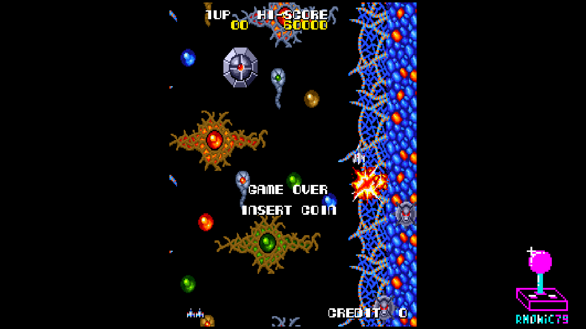 | 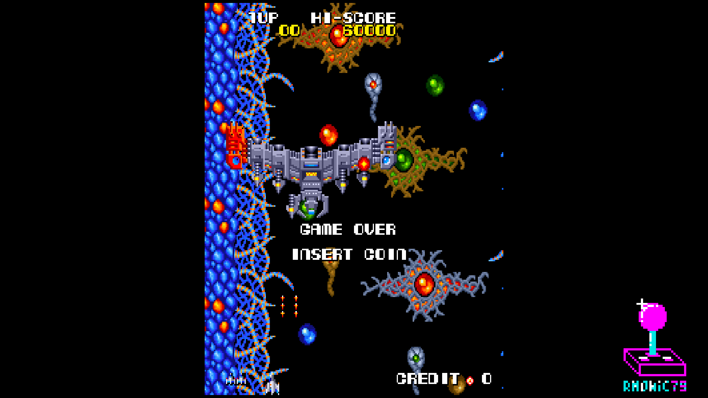 |
| Ufo Robo Dangar — attract, tate | Ufo Robo Dangar — boss, tate |
| 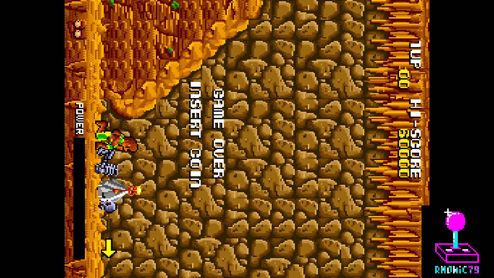 | 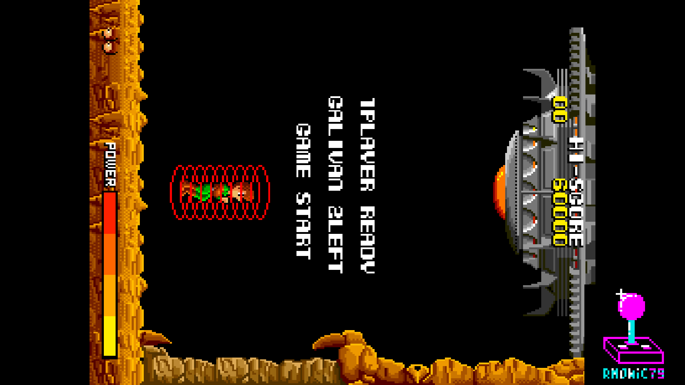 |
| Cosmo Police Galivan — attract, yoko | Cosmo Police Galivan — player ready, yoko |
| 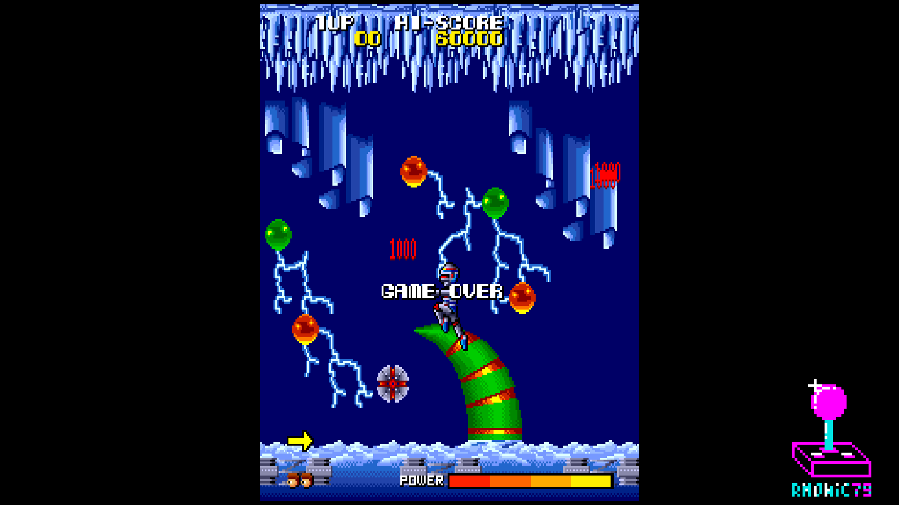 | 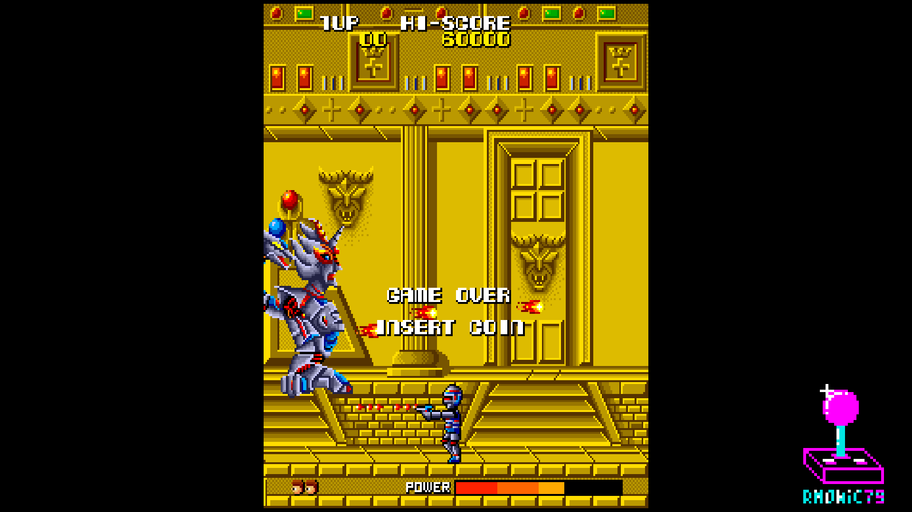 |
| Cosmo Police Galivan — ice stage, tate | Cosmo Police Galivan — boss, tate |
| 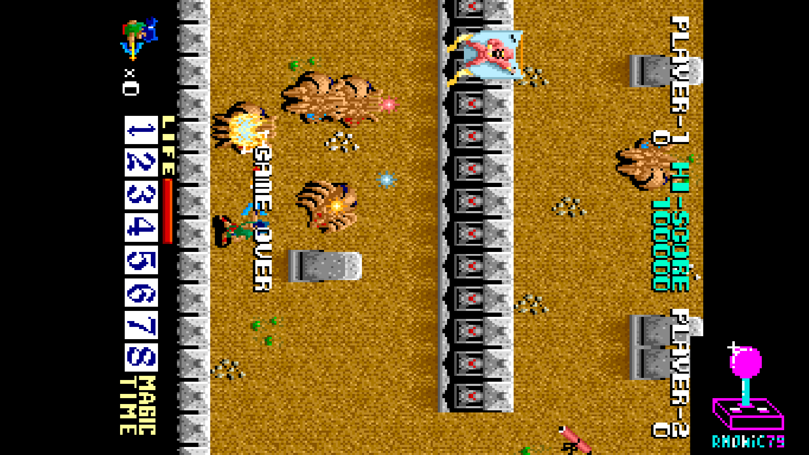 | 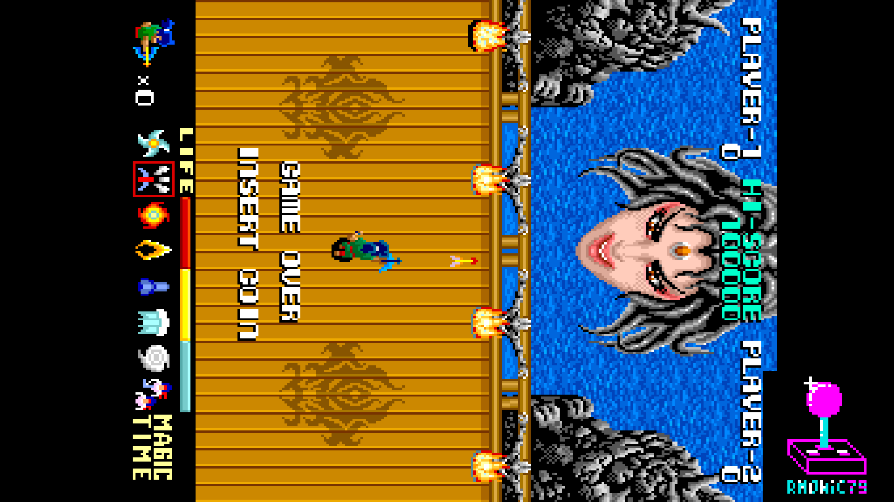 |
| Ninja Emaki — attract, yoko | Ninja Emaki — boss, yoko |
| 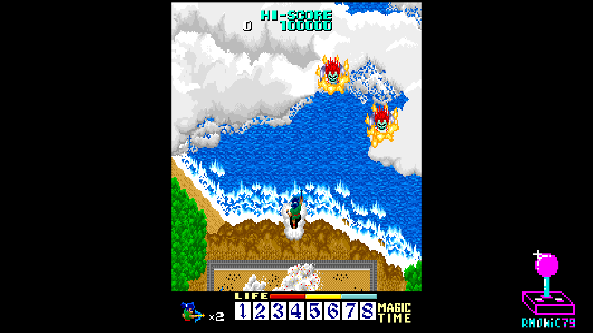 | 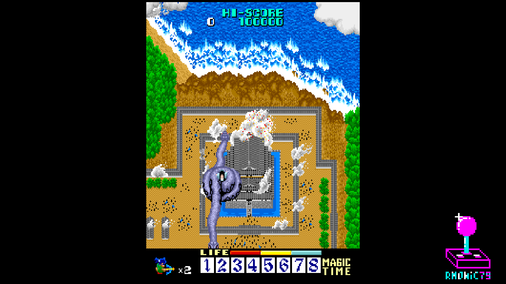 |
| Ninja Emaki — the coast, tate | Ninja Emaki — the shrine, tate |

## Hardware emulated

| Component      | Spec                                                          |
|----------------|---------------------------------------------------------------|
| Main CPU       | Z80B @ 6 MHz (12 MHz / 2), vblank IRQ                         |
| Sound CPU      | Z80A @ 4 MHz (8 MHz / 2), IRQ at 8 MHz / 2 / 512              |
| Sound chip     | Yamaha **YM3526** OPL @ 4 MHz (jtopl)                         |
| DACs           | 2× 8-bit R2R, full range, with the board's filters as biquads |
| Text layer     | 8×8, 4 bpp — CPU-driven, or drawn by the NB1414M4             |
| Background     | 16×16, 4 bpp, tile map ROM + scroll                           |
| Sprites        | hardware sprites, 4 bpp, per-sprite palette bank              |
| Palette        | colour PROMs + sprite lookup + sprite palette bank PROM       |
| Custom chips   | **NB1412M2** (Dangar, Japan), **NB1414M4** (Ninja Emaki)      |
| Raster         | 384 × 263 @ 6 MHz → 256×224 visible, 59.4106 Hz, ROT270       |

## Hardware requirements

- Terasic DE10-Nano
- MiSTer I/O board (recommended)
- SDRAM module
- Works on HDMI displays and on CRTs via the analog video output

## Building from source

Requires Quartus Prime 17.0 (free Lite Edition).

```
Open rmGalivan.qpf in Quartus → Processing → Start Compilation
```

Output bitstream is generated in `output_files/rmGalivan.rbf`.

## Running on MiSTer

The [releases/](releases/) folder contains the MRAs and a prebuilt bitstream.

1. Copy `rmGalivan_YYYYMMDD.rbf` to `_Arcade/cores/` on the MiSTer SD card,
   named `rmGalivan.rbf` — that is the name the MRAs look for. The official
   core keeps its own name, so both can sit there together.
2. Copy the three parent MRAs from `releases/` to `_Arcade/`, and the
   `_alternatives/` folder alongside them if you want the other eleven sets.
3. Provide your legally-owned merged `dangar.zip`, `galivan.zip` and
   `ninjemak.zip` where the MRAs expect them (usually in `games/mame/`).

**ROMs are NOT included in this repository.** You must provide them yourself.

## Repository layout

```
rm-Galivan_MiSTer/
├── rtl/
│   ├── dangar/          core RTL (main, video, sound, memory, biquad, NB1412M2, NB1414M4)
│   ├── t80/             Z80 CPU (T80)
│   ├── tv80/            Z80 savestate shim
│   ├── sound/jtopl/     YM3526 OPL
│   ├── ss/              savestate framework
│   ├── video/           pause overlay + rotate FIFO
│   ├── common/          DDR3 arbiter
│   ├── jtframe/         JTFRAME framework modules
│   └── pll/             clock PLL
├── sys/                 MiSTer framework + CRT Adjust / V-Size (sys-side)
├── logo/                pause overlay assets (font, logo, supporter list)
├── docs/                screenshots and the in-depth write-ups
├── releases/            MRA files (+ _alternatives/ for the other sets)
├── rmGalivan.qpf        Quartus project
├── rmGalivan.qsf        Quartus assignments
├── Template.sv          top-level wrapper
├── Template.sdc         timing constraints
├── files.qip            HDL file list
├── build_id.v           build version stamp
└── README.md            this file
```

## Acknowledgements

- **Luca Elia** and **Olivier Galibert**, authors of MAME's `galivan.cpp`, and
  the **MAMEDev team** — memory maps, raster timing, graphics layouts, mixing
  ratios and filter component values all come from there, and the RTL cites it
  line by line. The work on the three non-working sets started from there.
- **Angelo Salese** for MAME's NB1414M4 emulation, the reference the blitter
  was written and verified against.
- **Jose Tejada** ([@jotego](https://github.com/jotego)) for **jtopl** (YM3526),
  the **JTFRAME** framework and its SDRAM64 controller.
- **Daniel Wallner** for the **T80** Z80 CPU core, and **Sorgelig** for its
  MiSTer updates.
- **Guy Hutchison** for **TV80**, on which the Z80 savestate shim is built.
- **Martin Donlon** ([wickerwaka](https://github.com/wickerwaka)) for the
  savestate infrastructure, which reached this core through Raiden.
- **Andrea Bogazzi** ([@asturur](https://github.com/asturur)) for his help on
  one part of the CRT Adjust module during its development. The module is my
  own work; the part he helped with lives on in the module's repository.
- **Sorgelig** and the **MiSTer-devel team** for the framework, the SDRAM
  controller, the DDR3 interface and the Template.

## Support this project

If you enjoy this core and want to support its development:

- [Ko-fi](https://ko-fi.com/ibecerivideoludici) — one-time support
- [Patreon](https://www.patreon.com/IBeceriVideoludici) — monthly support
- [PayPal](https://www.paypal.me/IBeceriVideoludici) — one-time donation

## Follow

- [GitHub](https://github.com/rmonic79)
- [Twitch](https://twitch.tv/ibecerivideoludici) — live streams
- [YouTube](https://www.youtube.com/c/IBeceriVideoludici) — playlists and videos
- [X / Twitter](https://x.com/rmonic79)

## License

The RTL source code in this repository is provided as-is for educational
and preservation purposes under **GNU GPL v3 or later**. Original ROM data
is not included; users must provide their own legally obtained copies.

Original *Cosmo Police Galivan*, *Ufo Robo Dangar* and *Ninja Emaki* arcade
games © Nichibutsu (Nihon Bussan), 1985–1986.
